# Higor Manoel

### Diretor de Arte Sênior & Creative Technologist

**Direção criativa, IA generativa, performance e produtos digitais.**

Transformo estratégia de marca em sistemas visuais, campanhas e experiências digitais — da ideia ao protótipo funcional.

## Design que pensa. Tecnologia que tira ideias do papel.

Sou designer e diretor de arte com mais de **10 anos de experiência** em branding, motion, audiovisual, e-commerce e marketing de performance. Hoje, conecto esse repertório à IA generativa e ao desenvolvimento assistido por IA para criar com mais clareza, velocidade e intenção de negócio.

- 🎨 **Direção de arte & branding** — conceitos, identidades e sistemas visuais consistentes.
- ⚡ **IA generativa & creative technology** — imagem, vídeo, automação e prototipagem.
- 📈 **Creative performance** — campanhas, criativos, landing pages e experiências orientadas à conversão.
- 🧩 **Produtos digitais** — ferramentas, PWAs e geradores que unem design e código.

> A tecnologia amplia o processo criativo; repertório, intenção e direção continuam no comando.

## Projetos em destaque

| Projeto | O que ele demonstra | Stack |
| --- | --- | --- |
| [**PokeDev**](https://github.com/higormanoel/pokedev) | Card de contribuições com dados reais, pixel art original e animação em SVG. | JavaScript · SVG · GitHub Actions |
| [**Brand Manual PDF**](https://github.com/higormanoel/brand-manual-pdf) | Geração de manuais de marca editoriais em PDF, combinando design, automação e documentação. | HTML · CSS · Chrome |
| [**Nubank Dash**](https://github.com/higormanoel/nubank-dash) | PWA de finanças pessoais com importação de faturas e experiência pensada para mobile. | React · Vite · JavaScript |
| [**Workout PDF Generator**](https://github.com/higormanoel/workout-pdf-generator) | Gerador de treinos em PDF com direção visual, paleta automática e links interativos. | Python · PDF · Automação |
| [**GPMS Site**](https://github.com/higormanoel/gpms-site) | Site institucional e blog construído como uma experiência digital completa. | PHP · HTML · CSS · JavaScript |

## Caixa de ferramentas

## PokeDev — contribuições em pixel art

Minha atividade pública dos últimos 12 meses, transformada em um card pixel art com Charizard que atualiza automaticamente.

  

Projeto original disponível em <a href="https://github.com/higormanoel/pokedev"><strong>higormanoel/pokedev</strong></a>.

O card contabiliza commits públicos e contribuições reconhecidas pelo GitHub. Atividades privadas só aparecem quando a visibilidade de contribuições privadas está habilitada no perfil.

## Vamos construir algo relevante?

Se você trabalha com marcas, campanhas, produtos digitais ou quer incorporar IA à operação criativa, vamos conversar.

[**Ver portfólio**](https://higormanoeldesign.com.br) · [**Conectar no LinkedIn**](https://www.linkedin.com/in/higor-manoel-89106822b/) · [**Acompanhar no Instagram**](https://instagram.com/higormanoeldesign)

